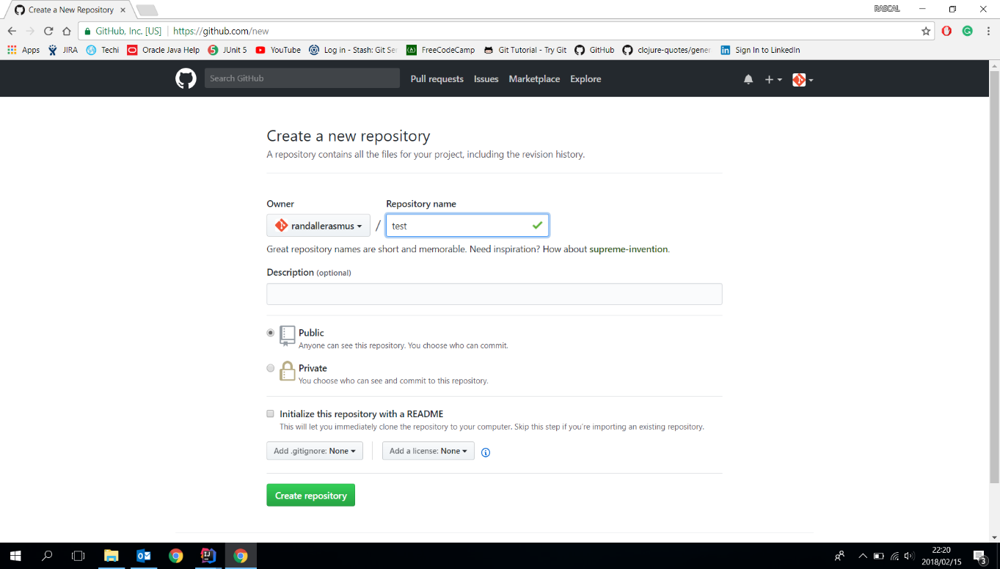
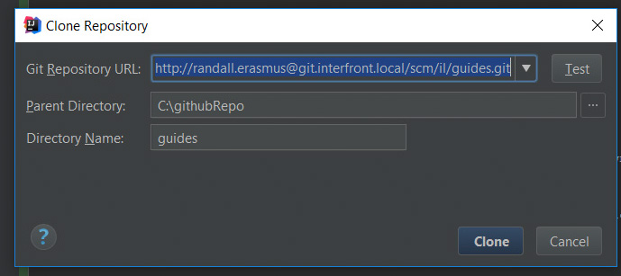

##GITHUB CONFIGURATION

Author: Randall Erasmus
Date: 2018-02-15

The following documentation will assist with the configuration required on how to use a github account 
with intellij.

# PREQUISITES

NB : Please make sure that the following setup is done before.
* Go to www.github.com and register an account 
 ####(Very important here that you remember your username and password to need it again during the cloning of your repo session)
 
* After your account is successfully created go to step 1
##Step 1
* Then create a new repository

##Step 2
* The copy the new Https link under your **QUICK SETUP HEADING** as shown below

##Step 3
Now Go to intelliJ and create a new project from version control as indicated 
below

##NB - Step 4 (Very important)
Take the link that you copied in Step 2 from your newly created **github** repo and 
and pasted it in your Git repository url as shown below.
* It is advisable that you create your a local directory for you to save your 
files to disk
* As also shown below give a meaningfull name to the Directory Name

* Then click Clone

While intellij is busy cloning the repo intellij could require login access to your remote github
repo that is hosted on www.github.com ,if login access has not been preconfigured prior to the 
setup.
 
